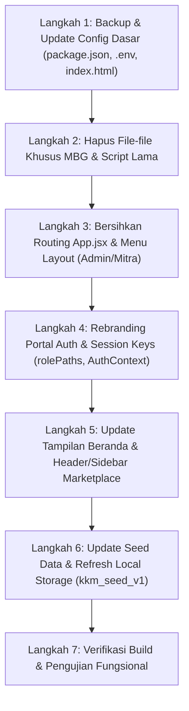

# 01. Panduan Migrasi: Menghapus Semua Keterkaitan Smart MBG & Disperindag Menuju KKM

Dokumen ini adalah panduan langkah-demi-langkah (step-by-step roadmap) untuk membersihkan seluruh elemen, rute, komponen, konfigurasi, dan identitas klien **Smart MBG (Makan Bergizi Gratis - Disperindag Garut / BGN)** dan bertransformasi penuh menjadi sistem **KKM (Koperasi Konsumen / Kelompok Kerja Mandiri Sukamaja - KKMP Sukamaja)**.

---

## 📌 Ringkasan Transformasi Domain Model

| Konsep Lama (Smart MBG / Disperindag) | Konsep Baru (KKM / KKMP Sukamaja) | Keterangan & Dampak |
| :--- | :--- | :--- |
| **Klien Utama** | Disperindag Garut & BGN | **KKM Sukamaja (Koperasi / Kelompok Kerja)** | Rebranding menyeluruh pada teks, logo, dan copyright |
| **Mitra (Dapur SPPG)** | Unit Usaha / Gerai KKM | Dapur gizi berubah menjadi gerai distribusi komoditas KKM |
| **Supplier** | Pemasok / Petani Mitra KKM | Tetap relevan: pemasok komoditas pangan & produk lokal ke KKM |
| **Logistik** | Armada Pengiriman KKM | Tetap relevan: kurir & armada distribusi antar gerai/anggota |
| **Penerima / Warga** | Anggota Koperasi & Konsumen | Dari penerima ransum MBG menjadi anggota pembeli di KKM |
| **Admin** | Administrator KKM Sukamaja | Dari pengawas Disperindag/BGN menjadi pengurus operasional KKM |
| **Menu Harian & Gizi (AKG)** | Katalog Produk / Paket Sembako | **Dihapus total** (kalkulator nutrisi, gramatur kalori, menu harian) |
| **Integrasi SIHARBATING / MISTER MBG** | Katalog Harga Komoditas Internal KKM | **Dihapus** koneksi scraping/API Mister MBG Disperindag |

---

## 🛑 TAHAP 1: Daftar Berkas & Folder yang Perlu DIHAPUS (Delete List)

Berikut adalah berkas-berkas spesifik yang murni ditujukan untuk program MBG / Disperindag dan tidak relevan lagi untuk KKM. Menghapus berkas ini akan meringankan ukuran kode dan menghindari kebingungan logika.

### 1.1. Konfigurasi & Script MBG
1. `config/smart-mbg-508408-647620470907.json`
   - *Alasan:* File kredensial Service Account Google Cloud untuk integrasi spreadsheet Smart MBG lama.
2. `scripts/update_sheet.mjs`
   - *Alasan:* Script yang bergantung pada kredensial MBG di atas dan spreadsheet ID lama.

### 1.2. Halaman & Komponen Khusus Menu Gizi & MBG (SPPG)
1. `src/pages/admin/AdminSppgMenus.jsx`
   - *Alasan:* Halaman admin untuk mengontrol menu makanan harian gizi siswa sekolah.
2. `src/pages/admin/AdminBapokting.jsx`
   - *Alasan:* Halaman yang memuat data scraping `SIHARBATING & MISTER MBG` milik Disperindag Garut.
3. `src/pages/mitra/MitraMenu.jsx`
   - *Alasan:* Halaman mitra untuk melihat rekomendasi menu makanan harian bergizi.
4. `src/pages/mitra/MitraNutrition.jsx`
   - *Alasan:* Halaman monitoring makro nutrisi (karbo, protein, lemak, target kalori MBG).
5. `src/components/mitra/IngredientNutritionCalculator.jsx`
   - *Alasan:* Komponen penghitung takaran gizi dan kalori bahan makanan.
6. `src/components/marketplace/WeeklyMenuCards.jsx`
   - *Alasan:* Kartu menu makanan harian (Senin–Sabtu) di beranda marketplace MBG.
7. `src/pages/mitra/MitraRecipients.jsx` (atau sesuaikan)
   - *Alasan:* Data penerima manfaat sasaran MBG (sekolah & siswa). Jika ingin dipakai untuk daftar anggota KKM, dapat di-refactor, atau dihapus jika menggunakan modul `AdminWarga`.

---

## 🛠️ TAHAP 2: Daftar Berkas yang Perlu DIUBAH / DIBERSIHKAN (Refactor List)

### 2.1. File Konfigurasi Inti & Root Proyek

#### A. `package.json`
- **Ubah properti `name`:**
  ```json
  // SEBELUM:
  "name": "smart-mbg-local",
  // SESUDAH:
  "name": "kkmp-sukamaja",
  ```
- **Hapus script yang tidak digunakan:**
  Hapus `"update-sheet": "node scripts/update_sheet.mjs"`.

#### B. `index.html`
- **Ubah Title dan Meta Description:**
  ```html
  <!-- SEBELUM: -->
  <title>SMART MBG — Sistem Manajemen Rantai Pasok Terintegrasi</title>
  <meta name="description" content="SMART MBG - Sistem Manajemen Rantai Pasok Terintegrasi untuk pengelolaan bahan pangan Kabupaten Garut" />
  
  <!-- SESUDAH: -->
  <title>KKM Sukamaja — Sistem Ekosistem Rantai Pasok Koperasi & Komoditas</title>
  <meta name="description" content="Platform digital pengelolaan rantai pasok, logistik, dan marketplace KKM Sukamaja." />
  ```
- Ganti favicon emoji 🛡️ dengan logo atau icon khas KKM Sukamaja.

#### C. `.env`
- **Hapus kredensial Mister MBG Disperindag:**
  ```env
  # HAPUS BARIS INI:
  MISTER_MBG_USERNAME=kadisperindag
  MISTER_MBG_PASSWORD=kadisperindag
  ```
- Pastikan `VITE_SUPABASE_URL` dan `VITE_SUPABASE_ANON_KEY` sudah mengarah ke database proyek KKM Sukamaja.

#### D. `vite.config.js` & `vercel.json`
- Di `vite.config.js` dan `vercel.json`, hapus proxy ke `https://satudata-api.garutkab.go.id` (`/satudata`) jika data KKM tidak lagi mengambil data terbuka Pemkab Garut.

---

### 2.2. Autentikasi, Session & Penyimpanan Lokal (Local Storage)

#### A. `src/lib/AuthContext.jsx`
- Ubah pengaturan default nama aplikasi di fungsi `checkAppState`:
  ```javascript
  // SEBELUM:
  setAppPublicSettings({ app_name: "SMART MBG", app_logo_url: null });

  // SESUDAH:
  setAppPublicSettings({ app_name: "KKM Sukamaja", app_logo_url: "/images/logo-kkm.png" });
  ```

#### B. `src/lib/rolePaths.js`
- Ganti semua kunci `localStorage` yang masih berawalan `smartmbg_` atau `smart_mbg_`:
  - `smartmbg_role` &rarr; `kkm_role`
  - `smart_mbg_user` &rarr; `kkm_user`
  - `smartmbg_login_email` &rarr; `kkm_login_email`
  - `smartmbg_intended` &rarr; `kkm_intended`
  - `smartmbg_name` &rarr; `kkm_name`

#### C. `src/pages/Portal.jsx`
- **Definisi Peran (`ROLES`):**
  - **`mitra`**: Ubah label dari `"Mitra Dapur SPPG"` menjadi `"Mitra Gerai / Unit Usaha KKM"`. Ubah default email dari `mitra.garut@smartmbg.id` menjadi `gerai.sukamaja@kkm.id`.
  - **`supplier`**: Ubah label menjadi `"Supplier & Petani Binaan"`. Ubah default email dari `supplier.pangan@smartmbg.id` menjadi `supplier@kkm.id`.
  - **`logistik`**: Ubah label dari `"Logistik & Armada MBG"` menjadi `"Logistik & Armada KKM"`. Ubah default email dari `logistik.armada@smartmbg.id` menjadi `logistik@kkm.id`.
  - **`penerima` / `warga`**: Ubah label dari `"Sekolah & Warga Penerima MBG"` menjadi `"Anggota Koperasi / Warga"`. Ubah default email dari `warga.garut@smartmbg.id` menjadi `warga@kkm.id`.
  - **`admin`**: Ubah label dari `"Administrator BGN & Disperindag"` menjadi `"Administrator KKM Sukamaja"`. Ubah default email dari `admin.mbg@garutkab.go.id` menjadi `admin@kkm.id`.
- **Footer Portal:**
  Ganti hak cipta dari:
  `© 2026 SMART MBG • Satuan Pelayanan Program Gizi & Disperindag Kabupaten Garut`
  menjadi:
  `© 2026 KKM Sukamaja • Kelompok Kerja Mandiri / Koperasi Sukamaja`.

#### D. `src/pages/Register.jsx`
- Ganti teks heading `"SMART MBG"` menjadi `"KKM SUKAMAJA"`.
- Ganti subteks menjadi `"Pendaftaran Anggota, Mitra Gerai & Supplier KKM"`.
- Ganti form pendaftaran SPPG menjadi form pendaftaran unit usaha/gerai.

---

### 2.3. Routing & Navigasi Antarmuka

#### A. `src/App.jsx`
- Hapus import dan route yang telah dihapus di Tahap 1:
  - `AdminSppgMenus`
  - `AdminBapokting`
  - `MitraMenu`
  - `MitraNutrition`
  - `MitraRecipients` (jika dihapus)
- Sesuaikan route redirect jika ada user yang mengakses link lama.

#### B. `src/pages/admin/AdminLayout.jsx`
- Hapus item menu:
  - `{ path: "/admin/bapokting", label: "SIHARBATING & MISTER MBG", icon: ShoppingBasket }`
  - `{ path: "/admin/sppg-menus", label: "Menu Harian SPPG", icon: CalendarDays }`
- Ubah label menu:
  - `"Manajemen Mitra/SPPG"` &rarr; `"Manajemen Gerai & Mitra KKM"`
  - `"Manajemen Warga/Penerima"` &rarr; `"Manajemen Anggota KKM"`
  - `"Chat Mitra/SPPG"` &rarr; `"Chat Gerai/Mitra"`

#### C. `src/pages/mitra/MitraLayout.jsx`
- Ganti properti `title="Portal Mitra / SPPG"` menjadi `title="Portal Mitra Gerai KKM"`.
- Hapus item menu:
  - `{ path: "/mitra/menu", label: "Rekomendasi Menu", ... }`
  - `{ path: "/mitra/nutrition", label: "Nutrition Page", ... }`
  - `{ path: "/mitra/recipients", label: "Penerima Bantuan", ... }`
- Ubah menu:
  - `{ path: "/mitra/kebutuhan", label: "Pengadaan Barang & PO", ... }`

---

### 2.4. Marketplace & Tampilan Publik

#### A. `src/components/marketplace/HomeHeader.jsx`
- Ubah logo dan teks branding:
  ```jsx
  // SEBELUM:
  <p className="text-base font-bold text-gray-900">Smart MBG</p>
  <p className="text-[10px] text-gray-500 hidden sm:block">
    Integrated Supply Chain Management for MBG Program
  </p>

  // SESUDAH:
  <p className="text-base font-bold text-gray-900">KKM Sukamaja</p>
  <p className="text-[10px] text-gray-500 hidden sm:block">
    Pusat Komoditas & Ekosistem Rantai Pasok Koperasi
  </p>
  ```

#### B. `src/components/marketplace/HomeSidebar.jsx`
- Ubah kartu login:
  ```jsx
  // SEBELUM:
  <h3 className="text-sm font-bold text-gray-900">Login ke Smart MBG</h3>
  <p className="text-xs text-gray-500 mt-1">
    Akses fitur lengkap untuk mengelola rantai pasok MBG Anda.
  </p>

  // SESUDAH:
  <h3 className="text-sm font-bold text-gray-900">Portal KKM Sukamaja</h3>
  <p className="text-xs text-gray-500 mt-1">
    Akses portal gerai, supplier, logistik, dan admin KKM.
  </p>
  ```

#### C. `src/pages/Marketplace.jsx`
- Hapus import `<WeeklyMenuCards />`.
- Ganti section Weekly Menu dengan slider promo komoditas, produk unggulan desa/koperasi, atau paket sembako hemat KKM.

#### D. `src/pages/GisPetaPage.jsx` & `src/pages/admin/AdminGis.jsx`
- Hapus badge `"Integrasi Resmi Disperindag Garut"`.
- Hapus link ke `"mistermbg.disperindag.garutkab.go.id/mbg"`.
- Ubah judul menjadi: `"Peta Persebaran Gerai & Jaringan Pasok KKM Sukamaja"`.
- Ubah layer marker dari titik SPPG dan sekolah menjadi titik: Gerai KKM, Gudang/Hub KKM, Petani/Supplier Pemasok, dan Posko Logistik.

#### E. `src/pages/KnowledgeCenter.jsx`
- Ganti data artikel artikel MBG (Dinas Ketahanan Pangan, SPPG, BGN) dengan panduan seputar:
  - Tata cara menjadi Anggota KKM Sukamaja
  - Syarat & ketentuan menjadi supplier lokal binaan
  - Panduan pemesanan & pengiriman komoditas bagi gerai
  - FAQ dan layanan simpan pinjam/transaksi digital koperasi (jika ada)

#### F. `src/pages/Career.jsx` & `src/lib/seed.js`
- Ganti deskripsi lowongan kerja dari "Kepala Dapur SPPG", "Doorman Gudang MBG" menjadi lowongan staf operasional KKM (Staff Gudang KKM, Admin Gerai, Kurir Pengiriman Sukamaja).
- Di `seed.js`, ganti nama dummy "Mitra SPPG Cikajang" menjadi "Gerai KKM Sukamaja 1", dsb.
- Ganti `SEED_VERSION = "smb_seed_v5"` menjadi `kkm_seed_v1` agar browser membersihkan cache seed lama saat pertama kali dibuka.

---

## 📋 TAHAP 3: Alur Kerja Eksekusi Step-by-Step (Urutan Kerja Rekomendasi)

Jalankan migrasi dengan urutan sistematis berikut agar tidak terjadi error broken import atau crash aplikasi:



### Rincian Eksekusi:

1. **Langkah 1 (Config Dasar):**
   - Update `package.json`, `.env`, dan `index.html`.
2. **Langkah 2 (Penghapusan File Mati):**
   - Hapus `AdminSppgMenus.jsx`, `AdminBapokting.jsx`, `MitraNutrition.jsx`, `MitraMenu.jsx`, `WeeklyMenuCards.jsx`, `IngredientNutritionCalculator.jsx`, `update_sheet.mjs`, dan kredensial json MBG.
3. **Langkah 3 (Penyesuaian Routing & Menu):**
   - Buka `src/App.jsx`, cabut route yang dihapus pada langkah 2.
   - Buka `AdminLayout.jsx` dan `MitraLayout.jsx`, hapus item menu yang mengarah ke route tersebut.
4. **Langkah 4 (Pembersihan Autentikasi & Brand Portal):**
   - Update `rolePaths.js` (ganti semua prefix key `smartmbg_` ke `kkm_`).
   - Update `AuthContext.jsx` (`app_name`).
   - Update `Portal.jsx` & `Register.jsx` (role descriptions, default email, footer).
5. **Langkah 5 (Pembaruan UI Publik):**
   - Update `HomeHeader.jsx` & `HomeSidebar.jsx`.
   - Update `Marketplace.jsx` (hapus pemanggilan WeeklyMenuCards).
   - Bersihkan teks Disperindag di `GisPetaPage.jsx` dan `AdminGis.jsx`.
6. **Langkah 6 (Migrasi Data Mock):**
   - Update `src/lib/seed.js` (ganti `SEED_VERSION`, ubah nama mitra dummy menjadi Gerai KKM, hapus mock data `weekly_menu`).
7. **Langkah 7 (Verifikasi & Uji Coba):**
   - Jalankan `npm run build` atau `npm run dev` untuk memastikan tidak ada import yang rusak (*missing module*).
   - Buka browser, bersihkan LocalStorage, dan lakukan login uji coba di `/portal`.

---

## 💡 Kamus Konversi Istilah Kode (Cheat Sheet)

| Kata Kunci Lama (Cari di Project) | Ganti Menjadi | Catatan |
| :--- | :--- | :--- |
| `Smart MBG` / `SMART MBG` / `smart-mbg` | `KKM Sukamaja` / `kkm-sukamaja` | Label aplikasi & nama project |
| `Dapur SPPG` / `Mitra SPPG` | `Gerai KKM` / `Unit Usaha KKM` | Penamaan entitas mitra |
| `Disperindag` / `Disperindag Garut` | `Pengurus KKM Sukamaja` | Otoritas / pengelola |
| `BGN` (Badan Gizi Nasional) | `Manajemen KKM` | Level otoritas tertinggi |
| `Penerima Sasaran` / `Penerima Bantuan` | `Anggota Koperasi` / `Konsumen` | Pengguna akhir |
| `Bapokting` / `SIHARBATING` | `Komoditas Pangan` / `Katalog Produk` | Modul harga pasar |
| `Mister MBG` | Dihapus / diganti `Sistem Internal KKM` | Scraping eksternal |
| `smartmbg_role` | `kkm_role` | Kunci localStorage |
| `smartmbg_intended` | `kkm_intended` | Kunci localStorage |
| `smb_seed_v5` | `kkm_seed_v1` | Kunci versioning seed database lokal |

---

*Dokumen ini dibuat otomatis sebagai panduan resmi transisi arsitektur frontend dari Smart MBG ke KKM Sukamaja.*
